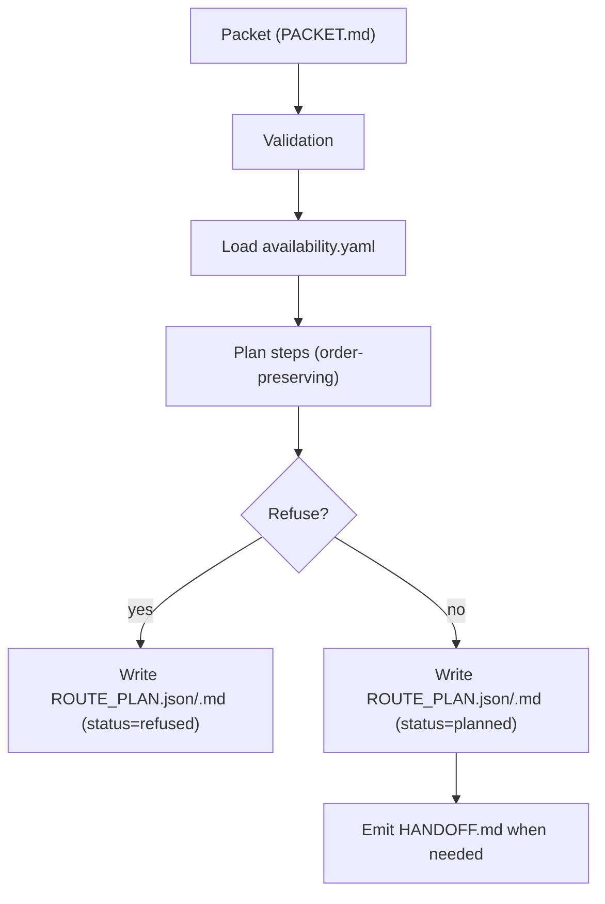

# Router

dopeTask Router v1 selects runner/model pairs deterministically and writes route artifacts.

See `10_ARCHITECTURE.md` for kernel principles.

## Flow



## Commands

```bash
dopetask route init --repo-root .
dopetask route plan --repo-root . --packet PACKET.md
dopetask route handoff --repo-root . --packet PACKET.md
dopetask route explain --repo-root . --packet PACKET.md --step run-task
```

## Config

`dopetask route init` writes:

- `.dopetask/runtime/availability.yaml`

## Deterministic artifacts

- `out/dopetask_route/ROUTE_PLAN.json`
- `out/dopetask_route/ROUTE_PLAN.md`
- `out/dopetask_route/HANDOFF.md`

## Refusal conditions and artifacts

Planner exits with code `2` when:

- required runner/model pairs are unavailable
- top score is below threshold

In refusal mode, plan artifacts are still written with:

- `status: refused`
- refusal reasons
- top candidates per step

