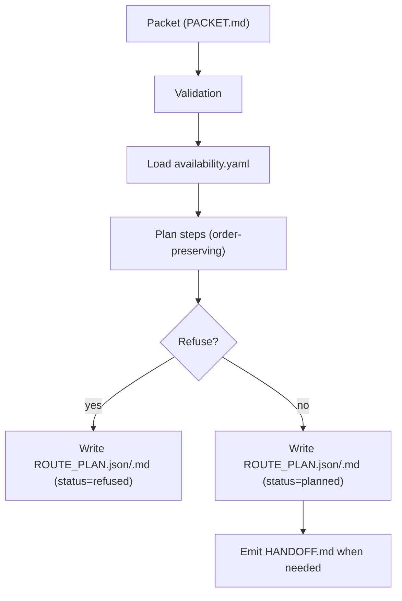

# Router

<<<<<<< HEAD
Audience: Contributors
Status: Deterministic Control Surface

The Router is not flexible.
It is decisive.

It does not negotiate.
It does not improvise.
It does not "try something else."

It evaluates.
It selects.
Or it refuses.

---

## Execution Flow

Packet
↓
Validation
↓
Availability Resolution
↓
Planner
↓
RoutePlan OR Refusal

No branch is silent.
Every branch ends in artifact emission.

---

## Validation

Validation is strict.

Malformed packet? Refusal.
Missing required fields? Refusal.
Unrecognized mode? Refusal.

No half-measures.
No "best effort."
No soft warnings.

---

## Availability Resolution

If a runner is requested:
- it must exist
- it must be permitted
- it must satisfy policy

If not: refusal.

The router does not downgrade.
It does not substitute.
It does not silently select "the next best thing."

You asked for something specific.
You get it, or you get a clean refusal.

---

## Order Preservation

Step order is sacred.

The router preserves declared order exactly.
It does not optimize.
It does not rearrange.

The packet is law.

---

## Deterministic Planning

Given identical:
- packet
- declared inputs
- version

The router must produce identical route plans.

If not, it is defective.

Determinism is not optional.

---

## Refusal Artifacts

Refusal is structured.

It includes:
- deterministic reason
- context snapshot
- stable exit code
- zero partial execution

No drama.
No stack-trace theatrics.
Just clean, documented non-execution.

---

## Auto vs Manual

If `mode = auto`:
- exactly one runner executes
- no fallback
- no parallelism

If `mode = manual`:
- no runner executes
- handoff artifacts emitted
- exit cleanly

The router is strict, not chaotic.

---

## What the Router Will Never Do

- retry silently
- switch runners behind your back
- execute multiple paths
- ignore policy
- mutate input
- hide behavior

If you want flexibility, build it above the kernel.
The router stays honest.
=======
TaskX Router v1 selects runner/model pairs deterministically and writes route artifacts.

See `10_ARCHITECTURE.md` for kernel principles.

## Flow



## Commands

```bash
taskx route init --repo-root .
taskx route plan --repo-root . --packet PACKET.md
taskx route handoff --repo-root . --packet PACKET.md
taskx route explain --repo-root . --packet PACKET.md --step run-task
```

## Config

`taskx route init` writes:

- `.taskx/runtime/availability.yaml`

## Deterministic artifacts

- `out/taskx_route/ROUTE_PLAN.json`
- `out/taskx_route/ROUTE_PLAN.md`
- `out/taskx_route/HANDOFF.md`

## Refusal conditions and artifacts

Planner exits with code `2` when:

- required runner/model pairs are unavailable
- top score is below threshold

In refusal mode, plan artifacts are still written with:

- `status: refused`
- refusal reasons
- top candidates per step

>>>>>>> codex/TP-DOCS-STRUCTURE-0002-doc-spine
